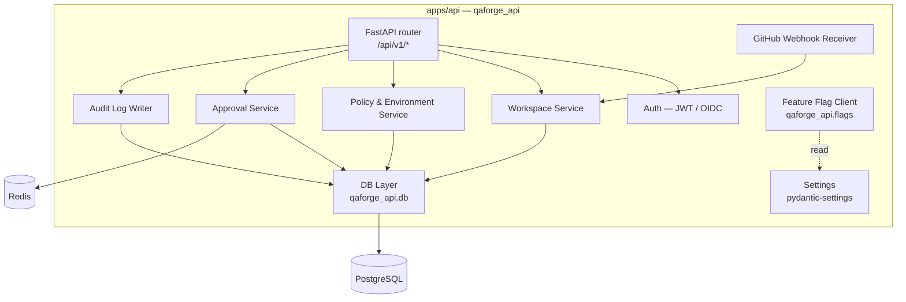
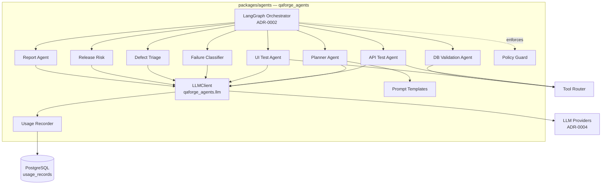
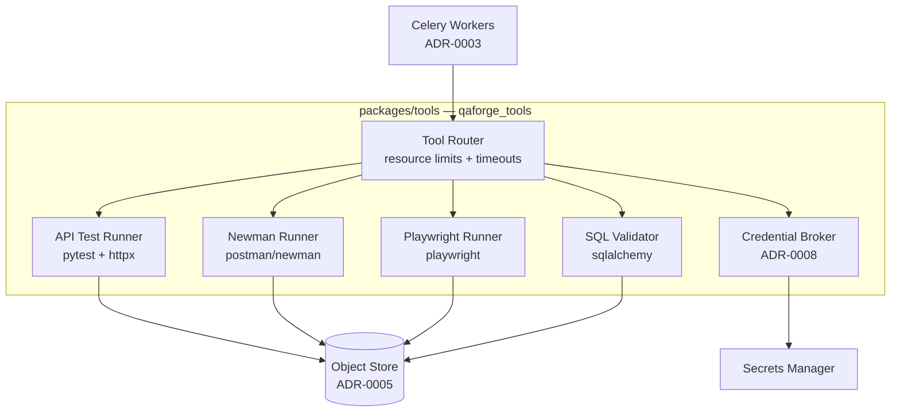
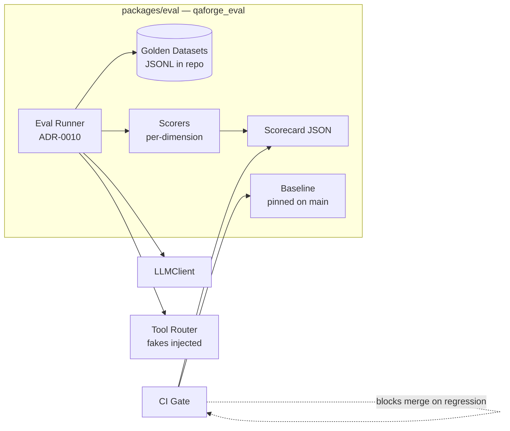
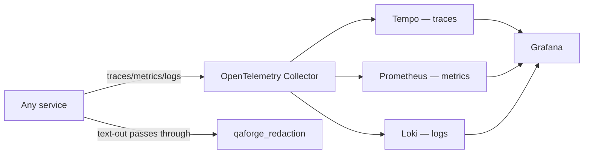

# C4 — Component

Decomposes the four planes from PRD §11 into the components that ship in
Phase 0 / Phase 1. One owning team per component is named below; missing
ownership is itself a flag in design review.

## Control Plane (`apps/api`)

| Component | Owning team | Notes |
|---|---|---|
| FastAPI router | Platform | PRD §13 surface |
| Webhook receiver | Platform | Signature-verified, tenant-scoped |
| Auth | Platform | OIDC + JWT (ADR-0008) |
| Workspace / Policy / Approval / Audit services | Platform | One module each under `apps/api/src/qaforge_api` |
| Feature Flag Client | Platform | Story 0.4.4 |
| DB Layer | Platform | SQLAlchemy 2.0 + Alembic (ADR-0007 RLS) |

## Intelligence Plane (`packages/agents`)

| Component | Owning team | Notes |
|---|---|---|
| Orchestrator | ML eng | LangGraph behind facade (ADR-0002) |
| 10 specialised agents | ML eng | PRD §10.1; one module each — never collapse |
| LLMClient + Recorder | ML eng | Story 0.4.2 |
| Prompt templates | ML eng | Versioned in Phase 3 (Epic 3.4) |
| Policy Guard | Security + ML eng | Enforces PRD §10.3 + cost/runtime caps |

## Execution Plane (`packages/tools`)

| Component | Owning team | Notes |
|---|---|---|
| Tool Router | Platform | Per-tool resource limits, declared budgets |
| API/Newman/UI/DB runners | Platform | Each sandboxed; outputs SHA-256 keyed |
| Credential Broker | Security | Per-run ephemeral credentials; never logged |

## Evaluation Plane (`packages/eval`)

| Component | Owning team | Notes |
|---|---|---|
| Runner | ML eng | Deterministic seeds; reuses prod LLMClient |
| Datasets | QA lead + ML eng | ≥ 50 cases per agent (Story 2.6.1) |
| Scorers | ML eng | Pluggable Python classes |
| CI gate | ML eng + SRE | Story 2.6.3 |

## Cross-cutting

| Component | Owning team | Notes |
|---|---|---|
| OpenTelemetry pipeline | SRE | ADR-0009 |
| Redaction utility | Security | Story 0.4.3 — applied at every text sink |
| Grafana dashboards | SRE | Version-controlled JSON in `infra/grafana/` |

## Data flows worth highlighting

- **PR analysis** (Phase 1 demo): GitHub webhook → Workspace Service → Orchestrator → Planner → API/UI Test Agents → Tool Router → Evidence (Object Store) → Failure Classifier → Report Agent → GitHub PR comment.
- **Approval-gated DB run** (Phase 2): Orchestrator pauses graph state, posts `approval_request`, Approval Service notifies Slack/email, approver clicks link → SSO → Approval Service resumes orchestrator via webhook.
- **Eval regression**: PR opens → CI runs `make eval` → Scorecard diff vs `main` baseline → block merge if dimension regressed > threshold.

## Conventions

- One owning team per component — leave no question of accountability.
- Components below the plane boundary are never imported across planes
  except via their public interface (the named class/module above).
- Component renames are an ADR-superseding event when the rename changes
  the public interface, not just the file.
