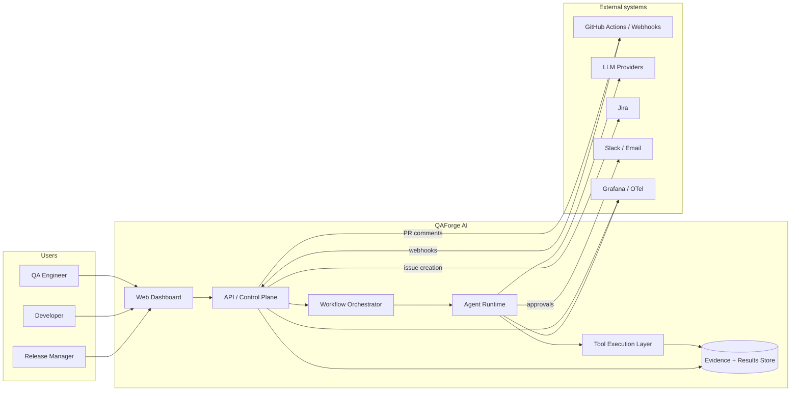

# C4 — Context

## Notes

- **Trust boundary** at the API and the GitHub webhook receiver — both
  validate signatures and apply tenant scoping.
- **Tool execution** is sandboxed (process or container) and never shares
  credentials with the agent layer directly; tools resolve credentials
  through a typed broker.
- **Evidence store** is write-once and content-addressed; no service has
  delete authority outside the retention sweeper.
