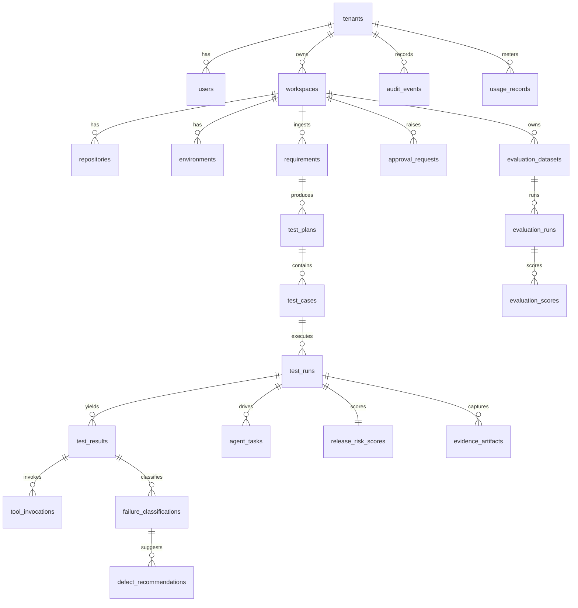

# Entity-Relationship Diagram

Maps PRD §12 entities to a normalised relational schema. All entities
(except `tenants` and `users`) carry a `tenant_id` for row-level
isolation. Timestamps (`created_at`, `updated_at`) are present on every
row but omitted from the diagram for clarity.

## Notes

- **Idempotency:** `test_runs` carries a unique `(workspace_id, idempotency_key)`.
- **Append-only:** `audit_events` and `usage_records` are insert-only; mutations are forbidden at the DB role level.
- **Content addressing:** `evidence_artifacts` references object-store keys keyed by SHA-256 (PRD §11.2 evidence store).
- **Indexes:**
  - `(tenant_id, workspace_id)` on every tenant-scoped table.
  - `(test_run_id, created_at desc)` for evidence/result fetches.
  - `gin (tags)` on `test_cases` for tag filters.
