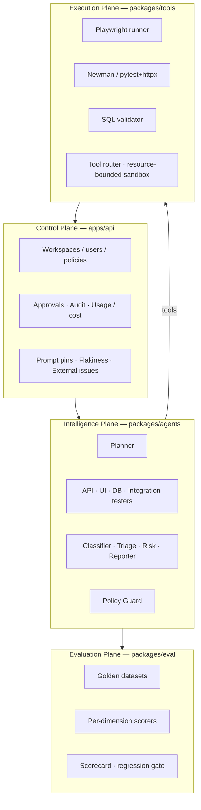
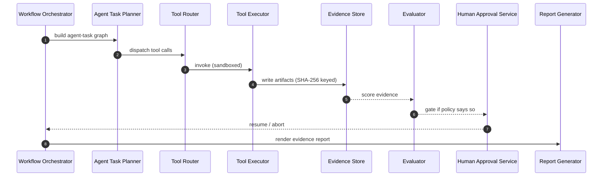
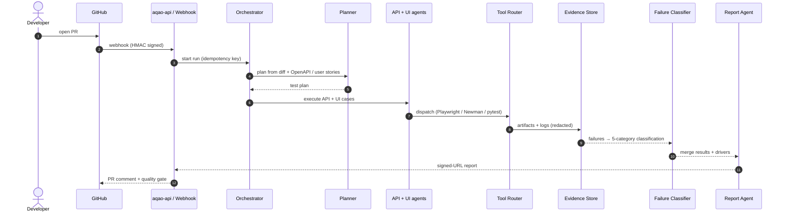
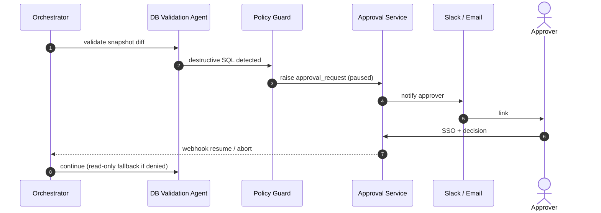
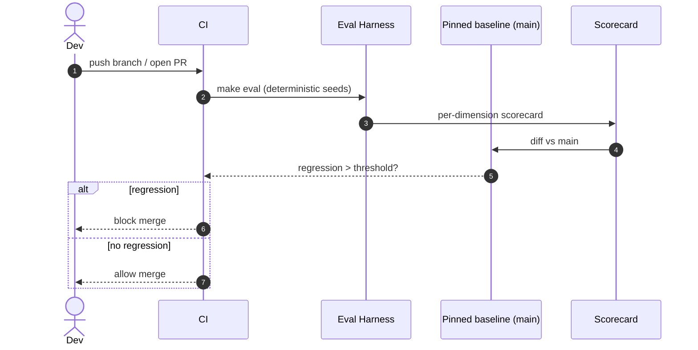
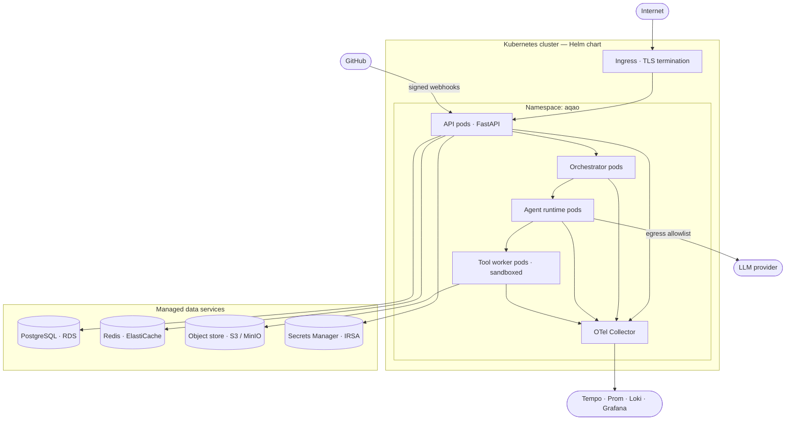
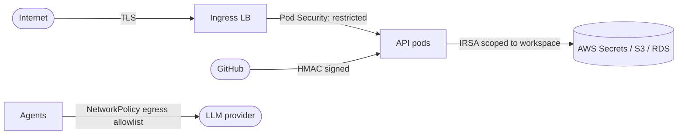

# Architecture diagrams

The detailed C4 set lives under [`docs/architecture/`](../architecture):
[context](../architecture/c4-context.md), [container](../architecture/c4-container.md),
[component](../architecture/c4-component.md), and the [ERD](../architecture/erd.md).
This page is the portfolio-friendly reading guide — every diagram below is
mermaid so it renders inline on GitHub.

## Four planes (PRD §11)

Each plane sits in its own package; cross-plane code is a smell — `CLAUDE.md`
keeps the boundary.

## Orchestration sequence (PRD §10.2)

Story 1.6.1 ships the runtime; Story 4.3 wraps each step in a circuit breaker
+ bulkhead.

## PR analysis flow (Phase 1 demo)

## Approval-gated DB run (Phase 2)

Approval gates are required for: destructive SQL, production-environment
tests, external Jira/GitHub issue creation, release readiness sign-off, CI
pipeline modifications, high-cost eval runs (PRD §9.10).

## Eval regression gate

## Deployment topology (production / Helm)

Terraform modules + Helm chart in [`infra/helm/`](../../infra/helm/);
GCP Cloud SQL Auth Proxy uses an `extraContainers` sidecar (TD-014).

## Data model

ERD lives at [`docs/architecture/erd.md`](../architecture/erd.md) in
mermaid `erDiagram` form. Highlights:

* Tenant-scoped tables enforce **row-level security** with
  `FORCE ROW LEVEL SECURITY` (ADR-0007).
* The audit log is append-only with HMAC-SHA256 signatures (Story 2.4.1).
* `external_issues` links defects to Jira/GitHub issues with a 24h dedup
  window (Story 3.2.1).
* `prompt_pins` per-workspace overrides the in-code prompt registry
  (Story 3.4.1).

## Trust boundaries

See [`docs/security/threat-model.md`](../security/threat-model.md) for the
full STRIDE matrix. The four crossings worth highlighting:

1. **Internet → Ingress LB → API pods** — TLS-terminated; Pod Security
   restricted profile (Story 3.6.2).
2. **GitHub → /api/v1/webhooks** — HMAC-signed (Story 1.2.1).
3. **API pods → AWS Secrets Manager / S3 / RDS** — IRSA (Story 3.6.1) with
   policies scoped to the workspace's resources.
4. **Agents → LLM provider** — egress allowlist via NetworkPolicy
   (Story 3.6.2); circuit-breaker + heuristic fallback when the provider is
   down (Story 4.3).

## ADR index

| ADR | Topic | Phase |
|---|---|---|
| 0001 | Pydantic v2 + extra=forbid for control-plane bodies | 0 |
| 0002 | LangGraph behind an internal facade | 0 |
| 0003 | Agent-task graph as the unit of orchestration | 1 |
| 0004 | LLM provider abstraction | 0 |
| 0005 | Object storage choice | 0 |
| 0006 | Frontend stack | 0 |
| 0007 | Postgres RLS + FORCE ROW LEVEL SECURITY | 1 |
| 0008 | Secrets management | 0 |
| 0009 | Telemetry stack | 0 |
| 0010 | Custom Python eval harness (no LangSmith) | 2 |

ADR sources are in [`docs/adr/`](../adr); template at `_template.md`.
